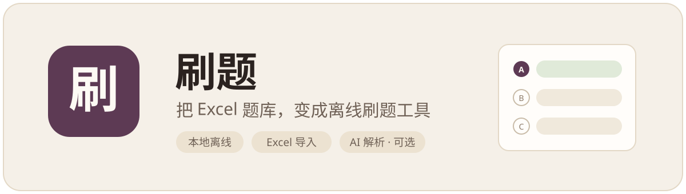
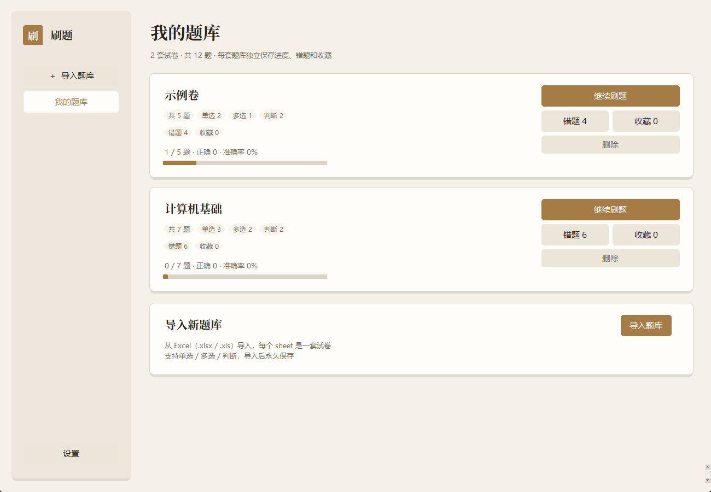

<div align="center">
  <sub><a href="README.md">中文</a> ｜ English</sub>
</div>

<div align="center">




-8a7968)


**Import an Excel question bank and start practicing.**

No internet, no sign-up. Your question bank, progress, and wrong answers stay on your own computer.

</div>

---

## UI

<div align="center">

<br/>

<br/><br/>

<table>
  <tr>
    <td width="50%" align="center"><br/></td>
    <td width="50%" align="center"><br/></td>
  </tr>
</table>

</div>

## Introduction

An offline quiz tool: your question bank never leaves your machine, with no question-count limit and optional self-configured AI explanations.

## Features

| | |
| --- | --- |
| **Import** | Accepts `.xlsx`; every Sheet becomes its own test paper, stored locally |
| **Single · Multiple · True/False** | Scored on submit, with explanations shown alongside the answer |
| **Wrong-answer notebook** | Mistakes go in automatically; they leave once you redo them correctly |
| **Auto-saved progress** | Close the app, reopen it, pick up at the same question |
| **Keyboard** | Letter keys to answer, arrow keys to move between questions |
| **Smart filtering** | Filters out questions answerable by keyword alone, builds a condensed review bank |
| **Themes** | Light and dark mode, adjustable font size |
| **AI explanations (optional)** | Can connect to OpenAI-compatible APIs, Ollama, or LM Studio to generate explanations for the current question |

## Quick Start

**1. Install the dependency.** The whole project has exactly one third-party package; requires Python 3.9+ (3.11 recommended):

```bash
pip install openpyxl
```

**2. Launch the app.** The UI is built on Python's bundled Tkinter — no extra GUI framework needed:

```bash
python main.py
# equivalent: python -m quiz_app
```

**3. Import a question bank.** Click "Import", pick an Excel file, and start drilling.

<details>
<summary><b>Being tidy: use a virtual environment</b></summary>
<br>

Windows (PowerShell):

```powershell
cd D:\path\to\quiz_app
python -m venv .venv
.venv\Scripts\Activate.ps1
# If script execution is blocked, use instead: .venv\Scripts\activate.bat
pip install -r requirements.txt
```

macOS / Linux:

```bash
cd /path/to/quiz_app
python3 -m venv .venv
source .venv/bin/activate
pip install -r requirements.txt
```

Conda works too:

```bash
conda create -n quiz python=3.11
conda activate quiz
cd /path/to/quiz_app
pip install -r requirements.txt
```

Activate the environment before each run.

</details>

<details>
<summary><b>Getting "No module named 'tkinter'"?</b></summary>
<br>

Your Python is missing the Tk component:

- **Windows**: re-run the official installer and check **tcl/tk and IDLE**
- **Ubuntu / Debian**: `sudo apt install python3-tk`
- **macOS**: prefer the python.org installer (the Homebrew build may lack Tk)

</details>

## Question Bank Format

The first row is the header. Only the **Question** column is required; everything else is optional:

| Column | Required | Description |
| --- | --- | --- |
| 题目 (Question) | ✅ | Question stem |
| 题型 (Type) | No | single / multiple / true-false; defaults to single |
| 选项 (Options) | Recommended for single/multiple | All options in one cell, or split into columns like 选项A, 选项B… |
| 答案 (Answer) | No | e.g. `A`, `A,B`, `对/错` (true/false), or the answer text itself |
| 解析 (Explanation) | No | Answer explanation |
| 难度 (Difficulty) | No | 简单 / 中等 / 困难 (easy / medium / hard) |

The app is forgiving about headers: common variants like 题干 or 正确答案 are recognized, and option markers like `A.` `A、` `A:` all work. `samples/示例题库.xlsx` is a ready-made sample, or regenerate it with `python scripts/make_sample.py`.

## Keyboard Shortcuts

| Key | Action |
| --- | --- |
| `A` `S` `D` `F` | Select the matching option (default) |
| `Enter` / `Space` | Submit a multiple-choice answer |
| `←` `↑` | Previous question |
| `→` `↓` | Next question |

Answer keys can be rebound to any letter, digit, `Enter`, or `Space` under *Settings · Shortcuts*; arrow-key paging is fixed. Arrows still page after you've answered, so you can go back and review — and when focus is inside the explanation panel, arrows keep their native scrolling instead of paging.

With a Chinese IME active, letter keys get swallowed by the input method. The app works around this automatically; if it still fails on your machine, switch to English input.

## AI Explanations (Optional)

Nothing changes if you never configure it.

When you want it, fill in your own model service under *Settings*: OpenAI, LM Studio, and vLLM use the "OpenAI-compatible" protocol; Ollama uses "Ollama". Only when you click "AI Explanation" does the current question leave your machine; the API key is stored in the local config file, or supplied via the `OPENAI_API_KEY` environment variable.

## Terms of Use

For personal study and question-bank review. Don't use it in exams, competitions, or formal assessments where external tools or AI assistance are prohibited — that line is yours to hold. Question content and AI explanations can be wrong; verify what matters.

## License

[MIT](LICENSE) — free to use, modify, and distribute.

---
